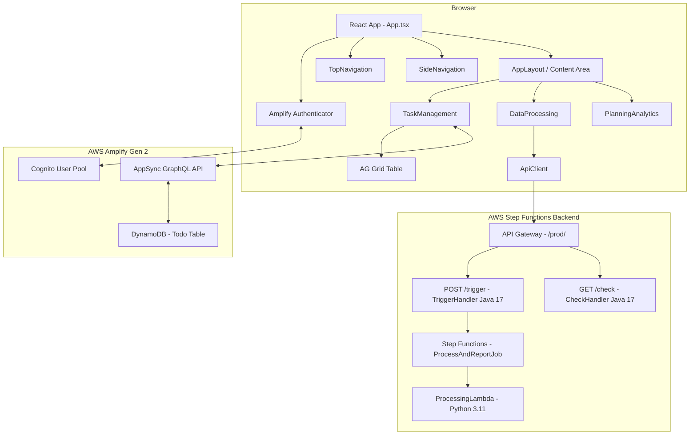

# Design Document

## Overview

MyWorkspace is a single-page React + TypeScript application backed by AWS Amplify Gen 2. It provides authenticated users with three modules in a unified shell: Task Management (CRUD todos with state tracking, ordering, and AG Grid display), Data Processing (trigger and monitor async analysis jobs via REST API), and Planning & Analytics (placeholder shell). Authentication is handled by AWS Cognito via the Amplify Authenticator component. The Cloudscape Design System provides all UI components.

The application is already substantially implemented. This design document formalizes the architecture, data models, and correctness properties for the existing system to guide testing, maintenance, and future development.

## Architecture



The app follows a module-per-file structure. `App.tsx` owns the shell (auth, navigation, layout) and passes navigation callbacks down to each module. State that must survive module switches (e.g., `utcMode`) is lifted to `App.tsx`. Each module is self-contained for its own data fetching and local state.

The Data Processing module communicates with an AWS Step Functions backend via API Gateway. The `POST /trigger` endpoint invokes a Java 17 `TriggerHandler` Lambda that starts a `ProcessAndReportJob` state machine execution. The `GET /check` endpoint invokes a Java 17 `CheckHandler` Lambda that polls execution status. The state machine orchestrates a Python 3.11 `ProcessingLambda` in one of three modes: `whole` (single invocation), `loop` (sequential Map), or `parallel` (concurrent Map).

## Components and Interfaces

### App Shell (`App.tsx`)

- Wraps the entire app in `Amplify Authenticator` to gate access.
- Renders `TopNavigation` with app title and user utilities (login ID + logout).
- Renders `AppLayout` with a collapsible `SideNavigation` listing the three modules.
- Maintains `currentModule` state to control which module is rendered.
- Lifts `utcMode: Set<string>` state for timezone toggles (shared with `TaskManagement`).
- Renders a footer below the `AppLayout`.

**Props / Callbacks passed to modules:**
```ts
interface ModuleProps {
  onNavigateHome: () => void;
}

interface TaskManagementProps extends ModuleProps {
  utcMode: Set<string>;
  setUtcMode: (mode: Set<string>) => void;
}
```

### TaskManagement (`src/modules/TaskManagement.tsx`)

- Subscribes to `client.models.Todo.observeQuery()` for real-time updates.
- On mount, back-fills `order` for any tasks that have `null` order.
- Renders an AG Grid table with columns: `#` (order, editable), content (double-click to edit), state (clickable badge), createdAt, updatedAt, actions (delete).
- Manages a create/edit modal (`showModal`, `editingTaskId`, `modalContent`).
- Manages filter state (`filter`) for state-based filtering.
- Delegates timezone formatting to `formatDate(date, isUtc)`.

**Key internal functions:**
```ts
createTodo(): void
handleSaveTask(): void
deleteTodo(id: string): void
toggleTodoState(id: string, currentState: string | null | undefined): void
updateTodoContent(id: string, content: string): void
updateTodoOrder(id: string, newOrder: number): Promise<void>
formatDate(date: Date | string | undefined, isUtc: boolean): string
```

### DataProcessing (`src/modules/DataProcessing.tsx`)

- Manages form state: `processType`, `itemListInput`, `maxConcurrency`.
- Manages job state: `loading`, `checking`, `status`, `result`, `error`.
- Manages `apiCallHistory` (prepend-on-call, cleared on new trigger).
- Uses `pollIntervalRef` to manage the 2-second polling interval.
- Calls `apiClient.post("trigger", payload)` then `apiClient.get("check?executionId=...")`.

**Key internal functions:**
```ts
triggerAnalysis(): Promise<void>
checkExecution(executionId: string): Promise<void>
addApiCall(endpoint, method, request, response): void
showNotification(item): void
```

### ApiClient (`src/utils/apiClient.ts`)

- Class-based HTTP client wrapping `fetch`.
- Constructor accepts a `baseUrl` (defaults to the production API Gateway endpoint).
- `request<T>(endpoint, options)` handles method, headers, body serialization, JSON parsing, and retry logic.
- Convenience methods: `get`, `post`, `put`, `delete`, `patch`.
- Exports a singleton `apiClient` instance.

```ts
interface ApiRequestOptions {
  method?: "GET" | "POST" | "PUT" | "DELETE" | "PATCH";
  headers?: Record<string, string>;
  body?: unknown;
  retries?: number;
  retryDelayMs?: number;
}

interface ApiResponse<T> {
  success: boolean;
  data?: T;
  error?: string;
  status: number;
}
```

### PlanningAnalytics (`src/modules/PlanningAnalytics.tsx`)

- Renders a `Container` with header "Planning & Analytics".
- Renders a `BreadcrumbGroup` with "MyWorkspace > Planning & Analytics".
- Calls `onNavigateHome()` when the "MyWorkspace" breadcrumb is followed.

## Data Models

### Todo (Amplify Data / DynamoDB)

Defined in `amplify/data/resource.ts`:

```ts
Todo: a.model({
  content: a.string(),   // Task description text
  state: a.string(),     // "not-started" | "in-progress" | "completed"
  order: a.integer(),    // Display sort order; null for legacy records
})
.authorization((allow) => [allow.owner()])
```

Amplify automatically adds:
- `id: string` — UUID primary key
- `createdAt: string` — ISO 8601 timestamp (managed by AppSync)
- `updatedAt: string` — ISO 8601 timestamp (managed by AppSync)
- `owner: string` — Cognito identity for owner-based auth

**State machine:**
```
not-started → in-progress → completed → not-started (cycles)
```

**Order invariant:** All tasks belonging to a user should have a non-null integer `order` value after the initial load migration runs.

### Analysis Job (REST API — AWS Step Functions via API Gateway)

Backend: `https://{id}.execute-api.us-west-2.amazonaws.com/prod/`

Two endpoints:
- `POST /trigger` — handled by **TriggerHandler** (Java 17 Lambda): validates request, generates UUID execution name, calls `StartExecution` on the `ProcessAndReportJob` state machine.
- `GET /check?executionId=...` — handled by **CheckHandler** (Java 17 Lambda): calls `DescribeExecution` and returns status + output.

The state machine has a 5-minute timeout and branches on `processType`:
- `whole` → single **ProcessingLambda** (Python 3.11) invocation with full payload
- `loop` → Step Functions Map state, `maxConcurrency=1` (sequential)
- `parallel` → Step Functions Map state, `maxConcurrency=items.length` (concurrent)

Invalid `processType` or missing fields cause an immediate `FAILED` state with an error message.

Trigger request payload:
```ts
interface TriggerRequest {
  processType: "parallel" | "loop" | "whole"; // required
  items: string[];       // array of non-empty strings; OR use 'item' for single string
  item?: string;         // convenience alternative to items[]
  maxConcurrency?: number; // positive integer, optional; defaults to item count (parallel) or 1 (loop)
}
```

Trigger response (HTTP 200):
```ts
interface TriggerResponse {
  message: string;       // "State Machine execution started successfully"
  executionId: string;   // UUID generated by TriggerHandler
}
```

Trigger error responses (HTTP 400):
```ts
// Invalid processType:    { message: "Invalid processType '...'. Must be one of: parallel, loop, whole" }
// Missing processType:    { message: "processType is required (parallel|loop|whole)" }
// Missing items/item:     { message: "Provide either 'items' (array of strings) or 'item' (single string)" }
// Empty strings in items: { message: "items must contain non-empty strings" }
```

Check response (HTTP 200):
```ts
interface CheckResponse {
  executionId: string;
  status: "RUNNING" | "SUCCEEDED" | "FAILED";
  output?: unknown;      // present on SUCCEEDED
  startDate?: string;    // ISO 8601
  stopDate?: string;     // ISO 8601; present when execution has ended
  cause?: string;        // present on FAILED
  error?: string;        // present on FAILED
}
```

### API Call History Entry (in-memory only)

```ts
interface ApiCallEntry {
  endpoint: string;
  method: string;
  request: unknown;
  response: unknown;
  timestamp: string; // ISO 8601
}
```

### UTC Mode (in-memory, lifted to App)

```ts
type UtcMode = Set<string>;
// Keys follow the pattern: "created-{taskId}" | "updated-{taskId}"
```


## Correctness Properties

*A property is a characteristic or behavior that should hold true across all valid executions of a system — essentially, a formal statement about what the system should do. Properties serve as the bridge between human-readable specifications and machine-verifiable correctness guarantees.*

### Property 1: Authenticated user identity is displayed

*For any* authenticated user, the TopNavigation utility bar should contain a text element matching the user's `loginId`.

**Validates: Requirements 1.4**

---

### Property 2: Module navigation renders the correct module

*For any* module link in the SideNavigation (Task Management, Planning & Analytics, Data Processing), selecting that link should cause the corresponding module component to be rendered in the content area.

**Validates: Requirements 2.3**

---

### Property 3: Breadcrumb home navigation works from any module

*For any* module that renders a BreadcrumbGroup with a "MyWorkspace" link, following that breadcrumb should set `currentModule` to `"home"` and render the home welcome screen.

**Validates: Requirements 2.5**

---

### Property 4: Task creation sets correct initial state and order

*For any* non-empty task content string and any existing task list, creating a new task should result in a task with `state = "not-started"` and `order = max(existing orders) + 1` being persisted to the Todo_Store.

**Validates: Requirements 3.2**

---

### Property 5: Whitespace-only content is rejected for task save

*For any* string composed entirely of whitespace characters (spaces, tabs, newlines), attempting to save it as task content (create or edit) should be rejected — no task should be created or updated, and the modal should remain open.

**Validates: Requirements 3.3, 6.3**

---

### Property 6: Task list is sorted ascending by order

*For any* set of tasks with defined `order` values, the task list displayed in the AG Grid should be sorted in ascending order by the `order` field.

**Validates: Requirements 4.1**

---

### Property 7: State filter shows only matching tasks

*For any* filter value (`not-started`, `in-progress`, `completed`) and any set of tasks, every task displayed after filtering should have a `state` matching the selected filter value. When filter is `all`, all tasks should be shown.

**Validates: Requirements 4.3**

---

### Property 8: Real-time updates are reflected in the task list

*For any* new data snapshot emitted by `observeQuery`, the displayed task list should be updated to match the emitted items (sorted by order).

**Validates: Requirements 4.6**

---

### Property 9: State cycle is a round trip

*For any* task, applying the state toggle three times (not-started → in-progress → completed → not-started) should return the task to its original state.

**Validates: Requirements 5.1, 5.2, 5.3**

---

### Property 10: State badge styling is distinct per state

*For any* task state value (`not-started`, `in-progress`, `completed`), the state badge renderer should return a visually distinct style object (different background color and text color) for each state.

**Validates: Requirements 5.4**

---

### Property 11: Non-empty content edit updates the task

*For any* task and any non-empty, non-whitespace content string, saving the edit modal should call `Todo.update` with the trimmed content.

**Validates: Requirements 6.2**

---

### Property 12: Order edit persists and re-sorts

*For any* task and any valid integer entered as the new order value, the task's `order` field should be updated in the Todo_Store and the displayed list should be re-sorted ascending by order.

**Validates: Requirements 7.2**

---

### Property 13: Null order tasks are migrated on load

*For any* set of tasks where some have `null` order values, after the initial load migration runs, all tasks should have non-null integer `order` values.

**Validates: Requirements 7.3**

---

### Property 14: Null order tasks sort to the end

*For any* mixed list of tasks (some with defined order, some with null order), tasks with null order should appear after all tasks with defined order values in the displayed list.

**Validates: Requirements 7.4**

---

### Property 15: Task deletion removes the task

*For any* task in the Todo_Store, calling delete with that task's `id` should result in the task no longer appearing in subsequent list queries.

**Validates: Requirements 8.1**

---

### Property 16: Timestamp formatting appends correct timezone label

*For any* timestamp value and any UTC/local mode, `formatDate` should append the correct timezone label — the local timezone abbreviation when in local mode, and "UTC" when in UTC mode.

**Validates: Requirements 9.1, 9.3**

---

### Property 17: Timezone toggle is per-cell and independent

*For any* cell key (e.g., `"created-{id}"`), toggling the UTC mode for that key should flip only that key's membership in the `utcMode` set, leaving all other keys unaffected.

**Validates: Requirements 9.2, 9.4**

---

### Property 18: Trigger payload contains correct fields

*For any* non-empty items list, process type, and optional valid positive integer max concurrency, the POST request to the `trigger` endpoint should contain `processType`, `items`, and `maxConcurrency` (when provided) with the correct values.

**Validates: Requirements 10.1, 10.5**

---

### Property 19: Empty items input prevents trigger request

*For any* input string that parses to zero non-empty items (empty string, whitespace-only, commas with no content), clicking "Trigger Analysis" should not send any HTTP request and should display an error notification.

**Validates: Requirements 10.2**

---

### Property 20: Item list parsing handles commas and newlines

*For any* string containing items separated by commas, newlines, or a mix of both, the parsed items array should contain exactly the non-empty trimmed values from the input.

**Validates: Requirements 10.3**

---

### Property 21: Trigger failure shows error notification

*For any* trigger response that either has `success: false` or lacks an `executionId`, the Data_Processor should display an error notification and not begin polling.

**Validates: Requirements 10.6**

---

### Property 22: API call history entry is prepended with correct fields

*For any* API call made to the `trigger` or `check` endpoint, a new entry should be prepended to the `apiCallHistory` array containing the correct `endpoint`, `method`, `request`, `response`, and a valid ISO 8601 `timestamp`.

**Validates: Requirements 12.2**

---

### Property 23: Clear history empties the history list

*For any* non-empty `apiCallHistory`, clicking the clear button should result in an empty history list.

**Validates: Requirements 12.5**

---

### Property 24: ApiClient sets Content-Type header on all requests

*For any* request made via `ApiClient.request`, the outgoing HTTP request should include the `Content-Type: application/json` header.

**Validates: Requirements 13.2**

---

### Property 25: ApiClient correctly parses response bodies

*For any* HTTP response with a valid JSON body, `ApiClient` should return the parsed object as `data`. For any response with a non-JSON body, it should return `{ text: <raw text> }` as `data`.

**Validates: Requirements 13.3, 13.4**

---

### Property 26: ApiClient retries up to the specified count

*For any* number of retries `N` (N ≥ 1) and a request that always fails, `ApiClient` should make exactly `N + 1` total attempts (1 initial + N retries) before returning the final failure response.

**Validates: Requirements 13.5**

---

## Error Handling

### Authentication Errors
- Handled entirely by the Amplify Authenticator component, which displays built-in error messages for invalid credentials, network failures, and account issues.

### Task CRUD Errors
- `client.models.Todo.*` calls can throw. The current implementation logs errors to the console (e.g., `updateTodoOrder`). Future improvement: surface errors via Cloudscape `Flashbar` notifications in the TaskManagement component.
- `observeQuery` subscription errors are not currently handled; the subscription silently stops. Future improvement: add an `error` handler to the subscription.

### Data Processing Errors
- Empty items input: validated client-side before any API call; error shown via `Flashbar`.
- Trigger request failure (network error, non-2xx, missing `executionId`): error notification shown via `Flashbar`; polling does not start.
- Poll request failure: polling is stopped immediately; error notification shown.
- `FAILED` execution status: polling stopped; error notification with `cause` field shown.

### ApiClient Errors
- Network errors (fetch throws): caught, returns `{ success: false, status: 0, error: message }`.
- Non-2xx HTTP responses: returns `{ success: false, error: data?.message || statusText }`.
- Non-JSON response bodies: falls back to `{ text: rawText }` without throwing.
- Retry exhaustion: returns the last failed response after all retries are consumed.

### Navigation Errors
- Invalid `href` values in SideNavigation or BreadcrumbGroup are handled by `event.preventDefault()` and explicit `setCurrentModule` calls, preventing any actual browser navigation.

## Testing Strategy

### Dual Testing Approach

Both unit tests and property-based tests are required for comprehensive coverage. Unit tests handle specific examples, integration points, and edge cases. Property-based tests verify universal correctness across all valid inputs.

### Property-Based Testing Library

Use **fast-check** for TypeScript/JavaScript property-based testing:

```bash
npm install --save-dev fast-check vitest @testing-library/react @testing-library/user-event
```

Each property test must run a minimum of **100 iterations** (fast-check default is 100 runs).

Each property test must be tagged with a comment in this format:
```
// Feature: myworkspace-app, Property {N}: {property_text}
```

Each correctness property defined above must be implemented by exactly one property-based test.

### Unit Tests (Specific Examples and Edge Cases)

Focus areas:
- **Authentication flow**: sign-in form renders when unauthenticated (Req 1.1), session established on valid login (Req 1.2), logout returns to sign-in (Req 1.3), error shown on invalid credentials (Req 1.5)
- **App shell rendering**: TopNavigation title (Req 2.1), SideNavigation module links (Req 2.2), home navigation from header (Req 2.4), footer rendering (Req 2.6)
- **Task Management UI**: Create Task button opens modal (Req 3.1), double-click opens edit modal pre-populated (Req 6.1), cancel discards changes (Req 3.4, 6.4), order column is editable (Req 7.1)
- **Data Processing UI**: process type dropdown options (Req 10.4), API Call History panel renders (Req 12.1), history entries have collapsible sections (Req 12.4), history cleared on new trigger (Req 12.6), polling starts immediately then at 2s intervals (Req 11.1, 11.6), RUNNING/SUCCEEDED/FAILED states update UI correctly (Req 11.2, 11.3, 11.4), poll stops on check failure (Req 11.5)
- **Planning & Analytics**: header renders (Req 14.1), breadcrumb renders (Req 14.2), breadcrumb navigates home (Req 14.3)
- **ApiClient**: all five HTTP methods are supported (Req 13.1), singleton instance is the same reference (Req 13.7), network error returns status 0 (Req 13.6)

### Property-Based Tests

One test per correctness property. Example structure:

```ts
import fc from "fast-check";
import { describe, it, expect } from "vitest";

describe("myworkspace-app properties", () => {
  it("Property 5: whitespace-only content is rejected", () => {
    // Feature: myworkspace-app, Property 5: whitespace-only content is rejected for task save
    fc.assert(
      fc.property(
        fc.stringOf(fc.constantFrom(" ", "\t", "\n")),
        (whitespaceStr) => {
          expect(whitespaceStr.trim()).toBe("");
          // assert that handleSaveTask with this input does not call Todo.create/update
        }
      ),
      { numRuns: 100 }
    );
  });

  it("Property 20: item list parsing handles commas and newlines", () => {
    // Feature: myworkspace-app, Property 20: item list parsing handles commas and newlines
    fc.assert(
      fc.property(
        fc.array(fc.string({ minLength: 1 }).filter(s => s.trim().length > 0), { minLength: 1 }),
        fc.constantFrom(",", "\n", ",\n"),
        (items, separator) => {
          const input = items.join(separator);
          const parsed = input
            .split(/[,\n]+/)
            .map(s => s.trim())
            .filter(s => s.length > 0);
          expect(parsed).toEqual(items.map(s => s.trim()));
        }
      ),
      { numRuns: 100 }
    );
  });

  it("Property 26: ApiClient retries up to the specified count", () => {
    // Feature: myworkspace-app, Property 26: ApiClient retries up to the specified count
    fc.assert(
      fc.property(
        fc.integer({ min: 1, max: 5 }),
        async (retries) => {
          let callCount = 0;
          // mock fetch to always fail
          // assert callCount === retries + 1 after request completes
          expect(callCount).toBe(retries + 1);
        }
      ),
      { numRuns: 100 }
    );
  });
});
```

### Test File Organization

```
src/
  __tests__/
    App.test.tsx              # Shell, navigation, auth examples
    TaskManagement.test.tsx   # Task CRUD examples + properties 4-17
    DataProcessing.test.tsx   # Data processing examples + properties 18-23
    ApiClient.test.ts         # ApiClient examples + properties 24-26
    properties/
      taskManagement.property.ts
      dataProcessing.property.ts
      apiClient.property.ts
```
